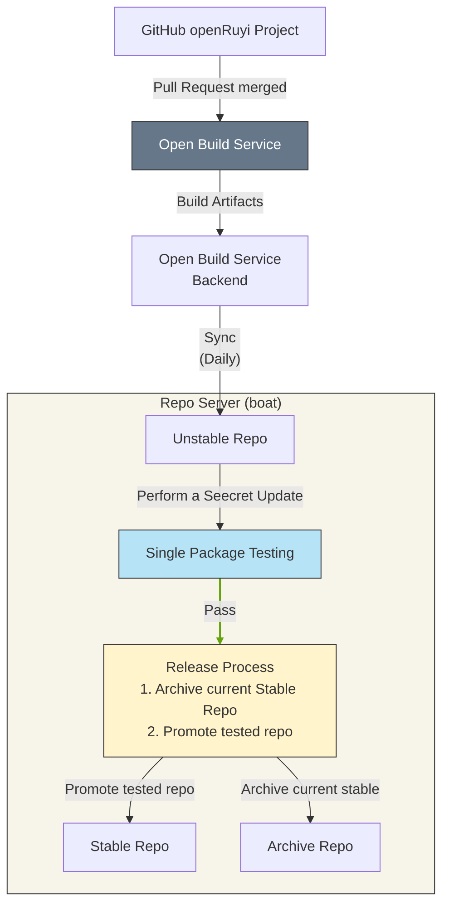
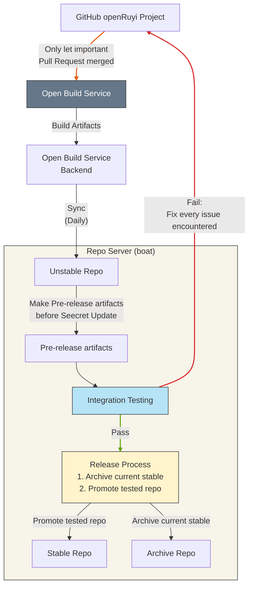

# openRuyi Repository Update Policy

The current document describes the package repository update process for openRuyi.

The freeze schedule dictates the repository update process in openRuyi. Therefore, the guide divides the process into two sections: Transition Period and Freeze Period, in accordance with the [Freeze Period Policy](/governance/policy/release-policies/freeze-period-policy).

## Transition Period

The transition period generally covers the first two weeks of each month. During the transition stage, openRuyi accepts changes as usual. Once maintainers accept the changes in a pull request, automation submits the updates to the openRuyi build system.

After the build system successfully builds a package, a scheduled job synchronizes it with the Unstable repository daily. The Unstable repository serves two purposes: it acts as the synchronization target for build system outputs, and users can also access the Unstable repository directly to get the latest packages, without using the build system itself as a package source.

Every Wednesday, the testing framework runs automated tests at the single-package level against the Unstable repository. If the automated tests pass, the synchronization script first copies the current contents of the Stable repository to the archive repository, then synchronizes the Unstable repository contents to Stable. We call the Wednesday update process as “Seecret Update Wednesday.”

If the automated tests fail, the system halts the update and posts a notification to the GitHub issue tracker. Once developers resolve and maintainers accept all issues, a maintainer may manually perform the same steps that normally follow a successful automated test run.

## Freeze Period

The freeze period generally covers the last two weeks of each month. During the freeze stage, openRuyi focuses on polishing the month-end images. As a result, maintainers normally do not accept new changes. In general, maintainers merge only targeted fixes for severe bugs. In short, maintainers manually review and control pull requests during the freeze period. As in the transition period, once maintainers accept the changes in a pull request, automation submits the updates to the openRuyi build system.

After the build system successfully builds a package, a scheduled job synchronizes it with the Unstable repository daily.

From the daily synchronization onward, the system no longer pushes updates directly to Stable. Instead, the release process introduces an intermediate step: the build system first creates release artifacts using the packages from the Unstable repository. The newly built release artifacts serve as the pre-release builds for that month’s release.

The testing framework then performs integration tests on the release artifacts. If the tests find any issues, the system immediately posts a notification to the GitHub issue tracker. Only after developers resolve and maintainers accept all issues will a maintainer manually synchronize the Stable repository contents to the archive repository, and subsequently synchronize the Unstable repository contents to Stable.

These steps ensure that the final delivered images are sufficiently stable and reliable.
