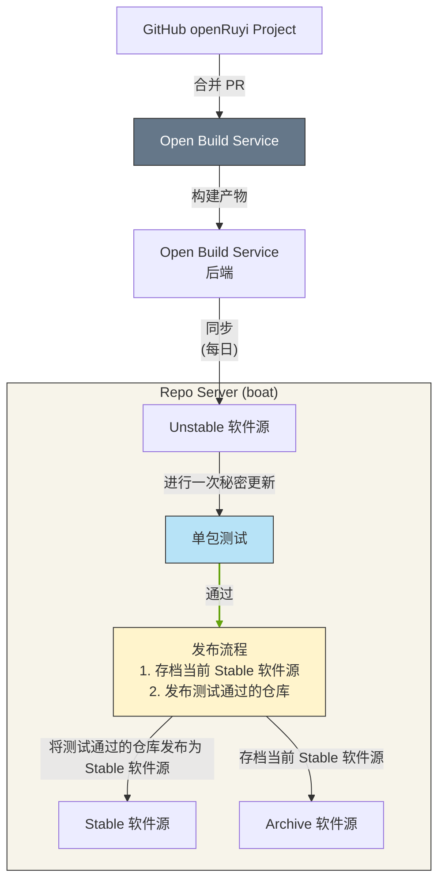
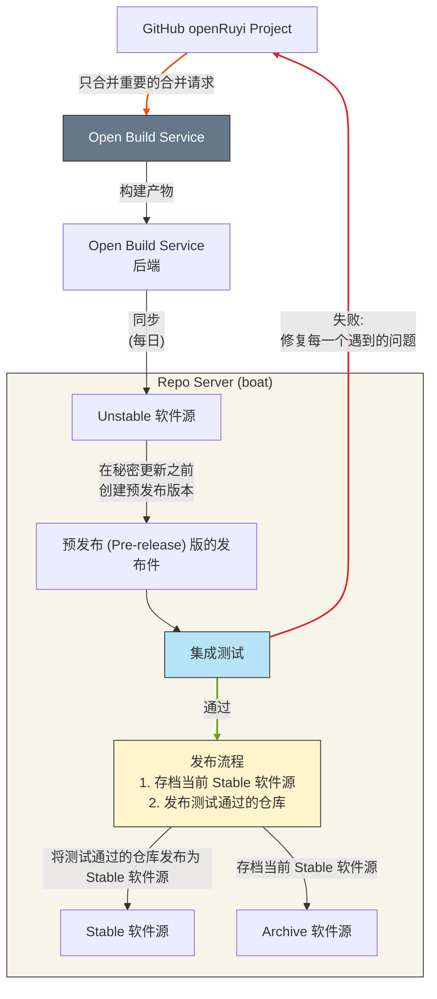

# openRuyi 软件仓库更新流程

本文档介绍了 openRuyi 软件仓库更新流程。
整个 openRuyi 的软件仓库更新流程会根据冻结期进行调整，所以本文会依照[冻结期说明](/governance/policy/release-policies/freeze-period-policy)分为"过渡期"和"冻结期"两个部分。

## 过渡期

过渡期一般为每个月的前两周。在这个阶段，openRuyi 会正常的接收任何更改。当合并请求内的更改被接收的时候，更改会被自动的推送到 openRuyi 的构建系统。

随后，软件包在构建系统上构建成功之后，会每天定点同步到 Unstable 软件仓。该仓一方面作为构建系统的成果同步仓，另一方面，该仓可直接提供给想要最新软件包的用户，避免了用户使用构建系统作为软件源。

每周三的时候，自动化测试会对这个仓进行单包测试。如果自动化测试通过，那么首先会将 Stable 软件仓的内容同步一份到存档软件仓，然后会将 Unstable 软件仓的内容同步到 Stable。我们称这个更新过程为“秘密更新 (Seecret Update)周三”。如果自动化测试失败，则不会进行更新，并会推送通知到 GitHub issue 列表。待所有问题解决并验收之后，可手动进行上述自动化测试通过的步骤。

## 冻结期

冻结期一般为每个月的后两周。在这个阶段，openRuyi 会专注于月底镜像的打磨，从而通常不会接收新的更改，通常来讲，我们只会合并严重 bug 的针对性修复。简言之，我们会人为的把控合并哪些合并请求。同样的，当合并请求内的更改被接收的时候，更改会被自动的推送到 openRuyi 的构建系统。

随后，软件包在构建系统上构建成功之后，会每天定点同步到 Unstable 软件仓。

之后，我们不再直接推送更新到 Stable，而是引入了一个中间步骤，先使用 Unstable 仓的软件包构建各个发布件，这些是我们该月发布件预发布版本 (Pre-release)。我们会对这些发布件进行集成测试，如果发现任何问题，都将会第一时间推送通知到 GitHub issue 列表。待所有问题解决并验收之后，才会手动的将 Stable 软件仓的内容同步一份到存档软件仓，然后将 Unstable 软件仓的内容同步到 Stable。这些环节都是为了确保最终交付的镜像足够稳定可靠。
